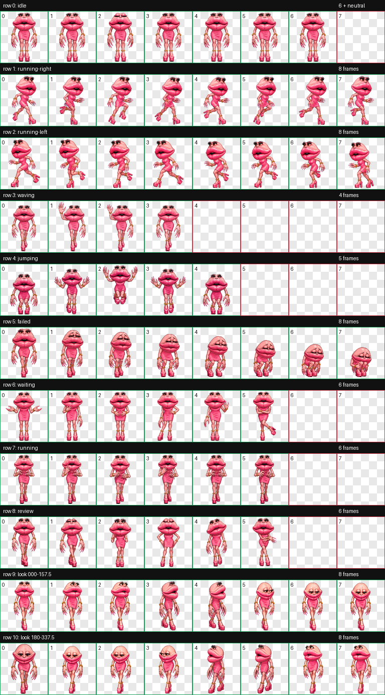

# Lupa Zalupa

> la la la la la lupa lupa zalupa



Lupa Zalupa is a playful, curious, and slightly dramatic animated companion for Codex. She stays quietly by your side while you think, springs into action while Codex works, and reacts as tasks move through their different states.

## What's included

```text
lupa-zalupa/
├── assets/
│   └── lupa-zalupa-preview.png
├── pet.json
└── spritesheet.webp
```

- `pet.json` contains the pet's name, description, sprite version, and spritesheet reference.
- `spritesheet.webp` is the complete transparent animation atlas.
- `assets/lupa-zalupa-preview.png` is the preview image used in this README.

## Requirements

- The Codex desktop app with **Pets** available in Settings.
- Access to this repository or a downloaded copy of it.
- No build tools or additional dependencies are required.

## Installation

Download or clone this repository, then open a terminal inside the downloaded `lupa-zalupa` folder.

Only `pet.json` and `spritesheet.webp` need to be installed. The `assets` folder is used for documentation.

### macOS or Linux

```bash
destination="$HOME/.codex/pets/lupa-zalupa"
mkdir -p "$destination"
cp pet.json spritesheet.webp "$destination/"
```

### Windows

Open PowerShell inside the downloaded folder and run:

```powershell
$destination = Join-Path $HOME ".codex\pets\lupa-zalupa"
New-Item -ItemType Directory -Force -Path $destination | Out-Null
Copy-Item -Path ".\pet.json", ".\spritesheet.webp" -Destination $destination -Force
```

### Enable Lupa Zalupa in Codex

1. Open **Codex**.
2. Go to **Settings**.
3. Open **Pets**.
4. Select **Refresh**.
5. Choose **Lupa Zalupa**.

If she does not appear, confirm that both files are together inside the `lupa-zalupa` folder, refresh the Pets list again, and restart Codex if needed.

## Animation states

Codex chooses Lupa Zalupa's animation automatically based on what is happening:

| State | When it appears |
| --- | --- |
| Idle | Codex is ready and waiting quietly. |
| Running right | Lupa Zalupa is being dragged toward the right. |
| Running left | Lupa Zalupa is being dragged toward the left. |
| Waving | A friendly greeting or wake-up moment. |
| Jumping | A playful interaction, such as hovering over her. |
| Failed | A task encountered a problem. |
| Waiting | Codex needs approval, help, or input from you. |
| Running | Codex is actively working on a task. |
| Review | A result is ready for you to look at. |
| Look directions | She follows movement around her in 16 clockwise directions. |

## Package specifications

| Property | Value |
| --- | --- |
| Sprite format | Codex pet v2 |
| Manifest version | `spriteVersionNumber: 2` |
| Atlas grid | 8 columns × 11 rows |
| Cell size | 192 × 208 pixels |
| Atlas size | 1536 × 2288 pixels |
| Image format | Transparent WebP |
| Standard animation rows | 9 |
| Directional look poses | 16 across the final 2 rows |

## Updating an existing installation

After downloading a newer version, copy `pet.json` and `spritesheet.webp` into the same installation folder and replace the existing files. Then return to **Settings → Pets**, select **Refresh**, and choose Lupa Zalupa again.

## A small personal note

Lupa Zalupa began as a personal gift for a friend who also uses Codex. She is shared in that same spirit: a small, handmade companion intended to make time spent working with Codex feel a little more playful and human.
